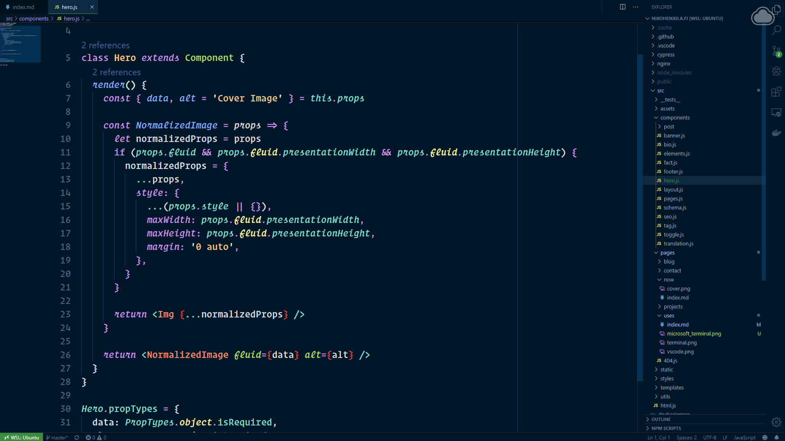
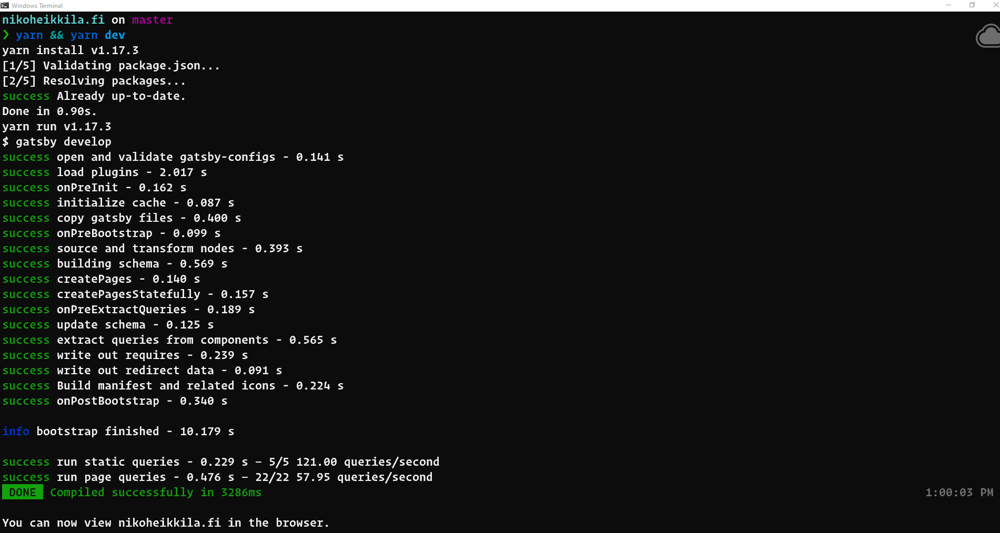

Some people are often puzzled about my setup – and the font I use – or just want to hear my recommendations for a given task. On this page I will describe the majority of tools I use to survive my day accompanied with links for the readers to try them out. I try to keep this page updated as often as possible.

This page was inspired by the works of [**Wes Bos**][wesbos] and [**Ali Spittel**][aspittel]. If you decide to make your own [/uses](/uses) page after reading this, please include me among the sources.

[wesbos]: https://wesbos.com/uses/
[aspittel]: https://zen-of-programming.com/uses

## Hardware and Platforms

I develop mainly on two platforms – excluding the Linux servers which are only deployment targets – that currently are **macOS** and **Windows 10**.

I'm using [AUKEY USB-C Hub][hub] to plug my peripherals to laptops when needed. I've mastered my setups so that there's no hindrance to my productivity while switching from the operating system to another. Hence, I discard arguments about operating system superiority ridiculous and inane.

My keyboard is [Logitech G413 mechanical keyboard][keyboard] which feels pleasant to type with and looks cool with its silvery brushed metal base. My mouse is [Steelseries Rival 300][mouse] which I've programmed with one macro for taking screenshots quickly. I generally advise against buying consumer products targeted for gaming audience or any gamer brand related stuff but these two devices have been affordable and served me well for a couple of years.

[hub]: https://www.amazon.com/AUKEY-Delivery-Charging-Chromebook-Pixelbook/dp/B072Q1SKZR/
[keyboard]: https://www.logitechg.com/en-us/products/gaming-keyboards/g413-mechanical-gaming-keyboard.html
[mouse]: https://steelseries.com/gaming-mice/rival-300

## Code Editor

My editor of choice is Visual Studio Code which I migrated to after using Atom and Sublime Text for some years. I dislike using full-blown IDEs as they are mostly resource hogs offering very little extra value to my workflow. All the posts and pages in this site have also been written with VS Code.

In the screenshot above I'm using a theme called [Night Owl][nightowl] and a font called [Operator Mono][operator].

To synchronize my settings and extensions across machines I use an extension called [Settings Sync][sync].

[nightowl]: https://aka.ms/nightowl
[operator]: https://www.cufonfonts.com/font/operator-mono
[sync]: https://marketplace.visualstudio.com/items?itemName=Shan.code-settings-sync

## Terminal

I haven't yet found a perfect terminal application so I've been hopping back and forth between [Hyper][hyper] and [iTerm][iterm]. The release of Microsoft's new [Terminal][msterminal] will change this when it becomes stable but for the time being, I'm satisfied with Hyper 3 which introduced some dramatic performance improvements for its latest release.

After years of cursing the _allfathers_ while navigating in a clunky Bash shell, I came across the [Friendly Interactive Shell (Fish)][fish]. I have then supercharged my Fish shell with the [Oh-My-Fish framework][omf] and the [Spacefish theme][spacefish].

While in the command line I use [`z`][z] to quickly jump to a project and [`fzf`][fzf] to remember the exact command I typed a few hours ago. These modifications let me swim in the command line like a fish in the sea. 🐟

Since Microsoft released their [Remote Development Pack for VS Code][remotedevelopment] which lets me access the files over SSH, WSL, or within a Docker container, I've largely given up on using Vim. However, on those rare occasions I need to use it I leverage the [SpaceVim][spacevim] configuration.

[hyper]: https://hyper.is
[iterm]: https://iterm2.com/
[msterminal]: https://github.com/Microsoft/Terminal
[fish]: https://fishshell.com/
[omf]: https://github.com/oh-my-fish/oh-my-fish
[spacefish]: https://spacefish.matchai.me/
[z]: https://github.com/rupa/z/
[fzf]: https://github.com/junegunn/fzf
[remotedevelopment]: https://marketplace.visualstudio.com/items?itemName=ms-vscode-remote.vscode-remote-extensionpack
[spacevim]: https://spacevim.org/

## Browser Setup

I've tried to live with virtually every browser made under the sun but the one I keep coming back to is [Vivaldi][vivaldi]. It's a browser from the company founded by Opera co-founder **Jon Stephenson von Tetzchner**. I really love the customizable UI, tab stacks, web panels, reader view, and quick commands it ships with.

Another promising newcomer is the new Microsoft Edge built from Chromium (as is Vivaldi). It still lacks some core features but it's interesting to follow the progress, nonetheless.

[vivaldi]: https://vivaldi.com/

## Desktop Apps

Although I consider myself an open-source advocate in most situations I have no problem paying and using commercial software when it's good. This will be a mouthful so I'll just list my used apps below.

I've marked apps I've purchased or subscribed to with a 💰sign. Most apps offer a limited free plan which I advise to check out as well if it covers your needs.

**I use...**

- [1Password 💰](https://1password.com) with a family plan for storing passwords, secure notes, software licenses, and even movie tickets. It's the best password manager out there and using anything else would cause me a mental breakdown.
- [Alfred 💰](https://www.alfredapp.com/) to boost my productivity with a variety of workflows and snippets.
- [Backblaze 💰](https://www.backblaze.com) to back up my two computers and HDDs. It does everything silently on the background which means I usually forget its existence and that's definitely a good feature from a backup manager.
- [CloudApp 💰](https://www.getcloudapp.com) to capture screenshots and videos to the cloud. Useful for reporting website issues.
- [Dropbox 💰](https://www.dropbox.com) with a 2 TB subscription to dump all my random things into.
- [Fork](https://git-fork.com) for viewing commit diffs and solving merge conflicts in Git. Sometimes the native command line `git` just isn't enough.
- [MindNode 💰](https://mindnode.com) for drawing, exporting, and sharing mind maps.
- [Notion 💰](https://www.notion.so/?r=6605af2045dd4c5bbf7a87d6d949c271) for writing notes, drafts, checklists, and keeping a personal micro-wiki around.
- [Postman](https://www.getpostman.com) for experimenting with REST APIs. If only it would support GraphQL.
- [Spectacle](https://www.spectacleapp.com) for organizing the windows in my desktop. Sadly, I haven't found a good Windows alternative but using the WIN and arrow keys is efficient enough.
- [TablePlus 💰](https://tableplus.io) for accessing relational databases, Redis caches, and more.
- [Todoist 💰](https://todoist.com) for reminding me to pay my rent each month and a heap of other stuff.
- [Toggl](https://toggl.com) for tracking time spent while working because my current employer requires me to send in a report monthly.

## Office

This section is under construction. I plan to build my own remote office with a new chair, an adjustable electric table, a laptop stand, and a couple more USB hubs for connecting. Feel free to throw suggestions for me.
